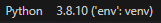
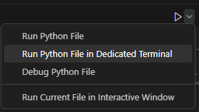

# Purpose of this Program

This is part of a Proof of Concept to investigate how to set up authentication and secure connections (https api calls) between D365 and an Azure Web app.  The Azure Web app will also communicate via other endpoints using http api calls.  The following scenarios must be tested to provide the basis for the design of the Azure Web app.

1. Use Azure AD authentication for one API, and no authentication for a second API in the same app
2. Use HTTPS for one API and HTTP for a second API in the same app
3. Validate the authentication token to ensure that the calling app is authorized to call this app

## Clone the Proof of Concept repo to you local folder

Navidate to a folder on your local drive where you want to create a local repo.  In a terminal window, execute the following command:

`git clone https://github.com/Lodewikus/b2b-api.git`

## Create a Python virtual environment

Go into the new directory of the local repo, and create a virtual environment called "env".  It is important to use this name, as .gitignore is already set up to exclude this folder.

```
cd b2b
python3 -m venv env
```
You need to change into the virtual environment to install the Python libraries.
```
source env/bin/activate
pip3 install -r requirements.txt
```

You don't need to stay in the virtual environment when you are using VS Code, so exit the environment.
```
deactivate
```

Start VS Code by typing `code .` from the command line, while you are in the b2b folder.

To make sure the code is executed from the Python instance in the local environment, check at the bottom right corner of VS Code that it is running Python from the virtual environment.  It should be as follows.<br>


Else, click on the environment (bottom right) and see if the virtual environment is one of the options in the list.  If not, do the following:
- Open the Command Palette (go to the View menu, or type CTRL-SHIFT-P)
- Start typing "Python: Select interpretor" and choose it from the list
- Click on "+ Enter interpreter path..."
- Type in `./env/bin/python` and press enter

If you want to run endpoint.py and test it from caller.py, these two programs must be run from different terminal sessions.  Do this by selecting the following:<br>


VS Code will show a list of the terminal sessions at the bottom right of the screen.  Make sure you select the correct terminal session there to see the output.

## App registration
An Azure AD App registration must be done for the api endpoint, that is, the app that will **receive** the api call from a third party app or system.  It is not necessary to register the calling system or app.  There is nothing in the App Registration that links the receiving application to the App Registration, even if that app is hosted in Azure. Instead, the receiving app must contain code to explicitly validate the token from the incoming caller.  See [Explanation of Token validation](#explanation-of-token-validation) further down.

Go to https://portal.azure.com, and do the following:
- Register new app in Azure AD
- Create a secret (Certificates & secrets menu)
- Add a scope (Expose an API menu)

Record the following for the app registration:
- Client Id
- Tenand Id
- Client secret
- Application ID URI (this is just "api://"{client_id})
- The app service for which this app registration is intended (although, this is not directly linked in the app registration)

The App Registration details are recorded on the following Google Sheet: [App Registrations](https://docs.google.com/spreadsheets/d/1VFr30rHDllmXOEfnDAjpbr5-WnjVFbSDuD1ZhHM5dA8/edit#gid=0)

## Testing HTTPS on a local dev environment
In order to test secure HTTP connections on a local environment, a certificate is required.  This can be a self-signed certificate.  See [Generate a self-signed certificate](#generate-self-signed-certificate) further below on how to create a certificate.

However, the validation of the self-signed certificate does not work (yet) on the local dev environment.  For testing purposes, the certificate validation is turned off by setting the option verify=False, as shown below.

```
response1 = requests.get('https://localhost:5000/api1', headers=headers, verify=False)
```

In order to test incoming API calls with and without SSL on a local machine, two instances of Flask servers are created; one to handle secure https calls and the other to handle http calls.  However, When the app is published in Azure, **this should not be necessary**, as Azure Web Apps are supposed to handle https and http calls.

<h2 id="explanation-of-token-validation">
  Explanation of Token validation
</h2>
Token validation is done using jwt.decode.

```
claim = jwt.decode(
    token,
    rsa_key,
    algorithms=["RS256"],
    audience='api://'+client_id
)
```
The variable `token` is obtained from the header of the incoming api call.  You can inspect the token by decoding it in a tool such as https://jwt.io. Verify that the 'aud' claim matches your Application ID URI (this is just "api://"{client_id}).

The variable `rsa-key` is generated by calling a "well-known" endpoint, as explained below.

In the code that generates the RSA key, the program first contacts the OpenID configuration endpoint, which is also known as the "well-known endpoint". This endpoint is a public endpoint that allows clients like our app to discover public keys and other useful metadata for validating JWTs. The URL of the endpoint is standard for all Azure AD tenants, and looks like this:

`https://login.microsoftonline.com/{tenant}/v2.0/.well-known/openid-configuration`

In this URL, `{tenant}` should be replaced with the ID of your Azure AD tenant.

When you make a GET request to this endpoint, you receive a JSON object with various fields. One of these fields is `jwks_uri`, which contains the URL of the JSON Web Key Set (JWKS) for your tenant. A JWKS is a set of keys that contains the public keys that should be used to verify any JWT issued by the authorization server. In our case, this server is Azure AD.

Next, the code makes a GET request to the `jwks_uri` and retrieves the JWKS. It then gets the unverified JWT header from the provided token to find the key ID (`kid`) of the key that was used to sign the JWT. 

The JWT header is a Base64Url encoded JSON string that contains information about how the JWT signature should be computed. One of the fields in the header is the `kid`, which is a hint indicating which key was used to secure the JWT. 

The code then goes through each key in the JWKS, looking for a key with a `kid` that matches the `kid` from the JWT header. Once it finds a matching key, it constructs an RSA key object that can be used to verify the JWT signature.

The constructed RSA key contains the following properties from the JWKS:

- `kty`: Key Type parameter. This defines the cryptographic algorithm family used with the key, such as "RSA".
- `kid`: Key ID parameter. This is used to match a specific key from the JWKS.
- `use`: Public Key Use parameter. This represents how the key was meant to be used. "sig" represents signature.
- `n`: RSA public key modulus.
- `e`: RSA public key exponent.

This RSA key is then used to decode and verify the JWT. This involves checking the JWT signature to make sure it hasn't been tampered with, and validating claims like the audience (`aud`) and issuer (`iss`). 

Here is the related part of the code:

```python
well_known_endpoint = f"https://login.microsoftonline.com/{your-tenant-id}/v2.0/.well-known/openid-configuration"
jwks_uri = requests.get(well_known_endpoint).json()["jwks_uri"]
jwks = requests.get(jwks_uri).json()
header = jwt.get_unverified_header(token)

rsa_key = {}
for key in jwks["keys"]:
    if key["kid"] == header["kid"]:
        rsa_key = {
            "kty": key["kty"],
            "kid": key["kid"],
            "use": key["use"],
            "n": key["n"],
            "e": key["e"]
        }
```

**Please note:** The audience above points to the Application ID URI, which is the client_id prepended by "api://".

<h2 id="generate-self-signed-certificate">
  Generate a self-signed certificate (for local dev environment)
</h2>

To test these two applications over HTTPS, you'll need to:

1. **Obtain an SSL Certificate**: This certificate can either be self-signed for development/testing purposes, or obtained from a Certificate Authority (CA) for production. Note that browsers and other HTTP clients will generally show warnings when accessing a server with a self-signed certificate unless it's added to the trusted root certificate store.

2. **Configure your Servers to Use HTTPS**: Both your Flask app (App1) and your client app (App2) need to be set up to use HTTPS.

Here's how you can achieve the steps above:

**Step 1: Generate a Self-Signed SSL Certificate**

You can generate a self-signed SSL certificate using OpenSSL. Run the following command in your terminal:

```bash
openssl req -x509 -newkey rsa:4096 -nodes -out cert.pem -keyout key.pem -days 365
```

This command will generate a new RSA private key (`key.pem`) and a self-signed certificate (`cert.pem`), valid for 365 days. It will ask you some questions about your identity - you can answer these with whatever you'd like.

The above will work on Ubuntu in the Windows Subsystem for Linux (WSL). OpenSSL is a robust toolkit for the Transport Layer Security (TLS) and Secure Sockets Layer (SSL) protocols and is available on a wide variety of platforms, including Ubuntu and other Linux distributions.

If OpenSSL isn't already installed on your Ubuntu system, you can install it with the following commands:

```bash
sudo apt-get update
sudo apt-get install openssl
```

**Step 2: Configure Flask to Use HTTPS**

Flask’s built-in server is not suitable for production as it doesn’t scale well and it doesn’t support HTTPS natively. However, for testing purposes, you can run Flask with SSL using the `ssl_context` argument to the `run` method. Here's how you can modify the Flask app to use the certificate:

```python
from flask import Flask

app = Flask(__name__)

@app.route('/')
def hello_world():
    return 'Hello, World!'

if __name__ == '__main__':
    app.run(ssl_context=('cert.pem', 'key.pem'))
```

Now, your Flask application will be served over HTTPS using the self-signed SSL certificate.

**Step 3: Configure the Client to Use HTTPS**

No specific configuration is needed for your client app (App2) to use HTTPS, `requests` library supports HTTPS by default. However, if you're using a self-signed certificate, you'll need to either supply the certificate or disable SSL verification (not recommended in production):

```python
# Using the self-signed certificate for verification
response = requests.get('https://localhost:5000/', headers=headers, verify='cert.pem')

# OR disabling SSL verification (not recommended in production)
response = requests.get('https://localhost:5000/', headers=headers, verify=False)
```

**Note**: Running your application over HTTPS in a production environment typically involves a different setup, where you would likely use a WSGI server such as Gunicorn or uWSGI, along with a reverse proxy such as Nginx or Apache, which would handle HTTPS connections. 

Please ensure to replace 'localhost:5000/' with your actual API server URL.


